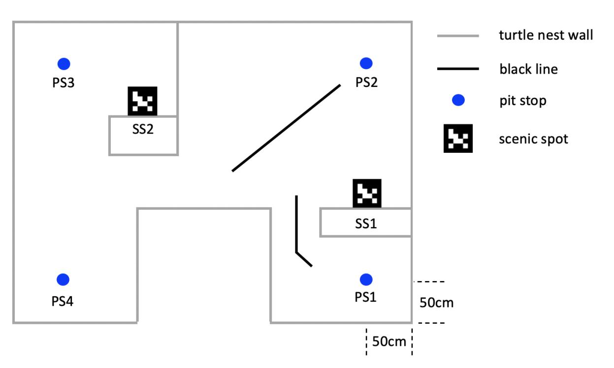

FabricFolding：无需专家示范的高效布料折叠学习
======
* 指导教师：[孟庆虎教授](https://scholar.google.com/citations?user=DxDCU7AAAAAJ&hl=en&oi=ao)（[IEEE Fellow](https://ieeexplore.ieee.org/author/37274117000)）、[王建坤教授](https://jkwang1992.github.io/)
* 团队成员：**何灿**、孟令啸
* 项目目标：让机器人在任意初始状态下自主完成布料展开与折叠。
* 详情见[项目页面](https://sites.google.com/view/fabricfolding/home)。

移动机器人导航与控制
======
* 指导教师：[张宏教授](https://scholar.google.com/citations?user=J7UkpAIAAAAJ&hl=en&oi=ao)
* 团队成员：Lingxiao Meng、**Can He**
* 项目目标：控制 Turtlebot3 从 PS1 导航到指定 PS 点，停留 1 秒并播报到达，同时识别两个指定 AruCo 标记。

