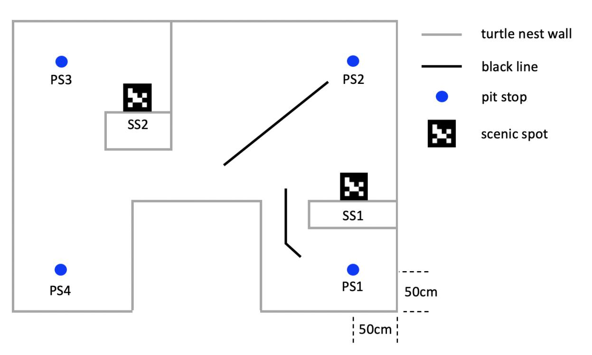

FabricFolding: Learning Efficient Fabric Folding without Expert Demonstrations
======

* Advisors: Prof. [Max Q.-H. Meng](https://scholar.google.com/citations?user=DxDCU7AAAAAJ&hl=en&oi=ao) ([Fellow, IEEE](https://ieeexplore.ieee.org/author/37274117000)); Prof. [Jiankun Wang](https://jkwang1992.github.io/)
* Team: **Can He**, Lingxiao Meng
* The objective is to enable the robot to autonomously unfold and fold fabric in arbitrary initial configuration.
* Please see [this page](https://sites.google.com/view/fabricfolding/home) for details

  

Mobile Robot Navigation and Control
======
* Advisors: Prof. [Hong Zhang](https://scholar.google.com/citations?user=J7UkpAIAAAAJ&hl=en&oi=ao)
* Team: Lingxiao Meng, **Can He**
* The objective is to command Turtlebot3 to navigate from PS1 to the designated PS point, pause for 1 second, issue an arrival command, and additionally recognize 2 specific AruCo markers.
<!--  -->

  

